# 🍽️ Smart Hall Meal Management System – Django Web Application

**Smart Hall Meal Management System** is a professional-grade Django web application designed to revolutionize hostel meal operations through automation, AI, and digital integration.

It manages **student meals, preferences, daily meal status, and monthly cost summaries** in a fully digital and scalable environment.  
This system empowers **students, managers, and admins** with seamless coordination — covering everything from **meal tracking, cost calculation, token issuance, verified payments, complaints, notices, and voting** to **AI-powered assistance**.

It goes beyond traditional web systems by offering:
- 🌐 **REST API endpoints** for mobile app and AI agent integration  
- 🤖 **Gemini AI Chatbot** for smart meal-related queries  
- 🐳 **Dockerized Deployment** for production-grade hosting  

> A **future-ready, intelligent, and modular hostel meal management system** for modern institutions.


---

## 🚀 Features (Till Now) — **Total 30+ Features**

### 🌟Core Highlights

- ✅ AI-Powered Chatbot – Gemini 2.0 Flash integrated chatbot for student queries and smart meal assistance
- 💳 Verified Payment System – Upload, verify, and manage monthly payment slips
- 🐳 Docker Support – Full Docker setup for easy deployment and isolated PostgreSQL database
- 📊 Automated Meal Costing – Dynamic calculation based on preferences & menus
- 🧠 Smart Substitutions – Beef ↔ Mutton, Fish ↔ Egg handled automatically
- 🗳️ Voting, Notices, and Reports – Engage, announce, and track everything in one system
- 💬 Complaints Module – Students can raise issues digitally
- 🔒 Role-Based Access – Secure portals for Admins, Managers, and Students


### 👨‍🎓 Student Features (9)
- 🟢 Toggle daily meal status (ON/OFF for breakfast, lunch, dinner)
- 🕕 Automatic meal cutoff system (before 8:00 PM)
- 🍛 Select monthly meal preference (Beef/Fish vs Mutton/Egg)
- 💰 View detailed monthly cost summary
- 📅 See cost history & total ON/OFF days
- 🗳️ Participate in hostel voting (Universal / Floor-wise polls)
- 📤 Upload monthly payment slips (image or PDF)
- 🧾 Track payment slip verification status (Pending / Verified)
- 💬 Interact with AI Chatbot (Gemini) for meal-related help
- 📝 Submit complaints or feedback

### 👨‍🍳 Manager Features (6)
- 👀 View student status by room number
- 🎟️ Issue meal tokens dynamically based on preferences
- 📊 View daily and monthly reports
- 📤 Export monthly summaries to Excel
- 📈 Track Beef/Mutton and Fish/Egg counts
- 🗳️ Manage polls and results

### 🧑‍💼 Admin Features (6)
- ➕ Register and manage all users (Admin, Manager, Student)
- ✏️ Edit/deactivate users
- 📊 Access global summaries and reports
- 👥 Manage roles and permissions
- 🧾 Generate monthly reports for all students
- ✅ Verify student payment slips (with pagination, filters, and highlights)


### 🍲 Meal Management (4)
- 📆 Manage weekly menus (Breakfast, Lunch, Dinner)  
- 🔄 Automatically handle substitutions:  
  - Beef → Mutton  
  - Fish → Egg  
- 💸 Calculate cost dynamically based on menu & preferences  
- 🗓️ Track total ON days and generate cost summaries for every student  


### 💳 Payment Slip Management (New Module)
- 📤 Students can upload monthly payment slips (image/PDF)
- 🧾 Admin can view, search, and verify payment slips
- 🎨 Modern UI – clean card-based layout with status indicators
- 🔍 Search & filter by month or student
- ⚡ Pagination for large data
- 🚫 Students cannot re-upload once verified
- ✅ Verified slips are visually highlighted for clarity


### 🗞️ Notices & Complaints (2)
- 📰 Create and view notices (with images)
- 📝 Submit and manage complaints


### 🗳️ Voting System
- 📌 Floor-wise voting  
- 🌐 Universal voting  


### 🧠 AI Chatbot (Gemini Integration)
- 🤖 Built-in student chatbot powered by Google Gemini 2.0 Flash API
- 💬 Students can ask meal-related, system, or hostel questions
- 🧩 Integrated via ai_utils.py using .env stored GOOGLE_API_KEY
- 🔒 Secure environment handling — no hardcoded keys


### 🧩 REST API Integration
- 🧠 Designed to serve AI systems and external mobile apps
- 📡 Exposes secure, authenticated DRF endpoints
- 📊 Can be used for data analysis, ML training, or predictive systems
- ⚙️ Used internally for chatbot queries and decision support


### 🐳 Docker Deployment Support
- 🗂️ PostgreSQL container for database isolation
- 📦 Django app container using .env for all secrets
- 💾 Persistent volumes for static & media files
- ⚙️ Docker Compose for one-command setup


---

## 🛠️ Tech Stack

- **Backend**:  Django 5.x (Python 3.11+)
- **Frontend**: Tailwind CSS + HTML Templates Bootstrap
- **Database**: PostgreSQL
- **AI Integration**:	Google Gemini 2.0 Flash
- **Deployment**:	Docker + Docker Compose
- **Excel Export**: `openpyxl`
- **Authentication**: Custom User Model with Role-based Access
- **Version Control**: Git + GitHub
- **API**: Django REST Framework (DRF)
---


## 📁 Project Structure
```
meal_management/
├── accounts/               #(Admin/Manager/Student)
├── admins/                 # Admin-related views & controls
├── managers/               # Manager dashboards,token issue,reports export
├── students/               # Student dashboard, daily status, preferences
├── meal_system/            # Core app for meal types, weekly menu, and summaries
├── chatbot/                # Gemini AI integration (ai_utils.py)
├── notices/                # Notice management module
├── votes/                  # Voting system app
├── media/                  # User-uploaded files 
├── static/                 # Static assets (CSS, JS, images)
├── templates/              # Global and app-level templates
├── .env                    # Environment variables
├── Dockerfile
├── docker-compose.yml
├── requirements.txt        # Dependencies
├── manage.py
└── README.md
```


---

## ⚙️ Setup Instructions

### 1. Clone the Repository
```
git clone https://github.com/mdmahfuzbipu/meal_system.git
cd meal-management-system
```
### 2. Create and Activate Virtual Environment
```
python -m venv venv
source venv/bin/activate       # On Windows: venv\Scripts\activate
```
### 3. Install Dependencies
```
pip install -r requirements.txt
```
### 4. Create .env File
At the root of your project:
```
DEBUG=True
SECRET_KEY=your-secret-key
ALLOWED_HOSTS=127.0.0.1,localhost
DATABASE_URL=postgresql:///db.postgresql
```
### 5. Apply Migrations
```
python manage.py migrate
```
### 6. Create Superuser
```
python manage.py createsuperuser
```
### 7. Run the Server
```
python manage.py runserver
```
### 8. Access the App 🌐

🏠 Main App: http://127.0.0.1:8000

🔐 Admin Panel: http://127.0.0.1:8000/admin


## 📸 Screenshots

<style>
.gallery {
  display: flex;
  flex-wrap: wrap;
  justify-content: center;
  gap: 10px;
}
.gallery figure {
  margin: 0;
  text-align: center;
  flex: 1 1 30%; 
  max-width: 250px;
}
.gallery img {
  width: 100%;
  height: 150px;
  object-fit: cover;
  border-radius: 10px;
}
.gallery figcaption {
  margin-top: 5px;
}
@media (max-width: 900px) {
  .gallery figure {
    flex: 1 1 45%; 
  }
}
@media (max-width: 600px) {
  .gallery figure {
    flex: 1 1 90%; 
  }
}
</style>

<div class="gallery">
  <figure>
    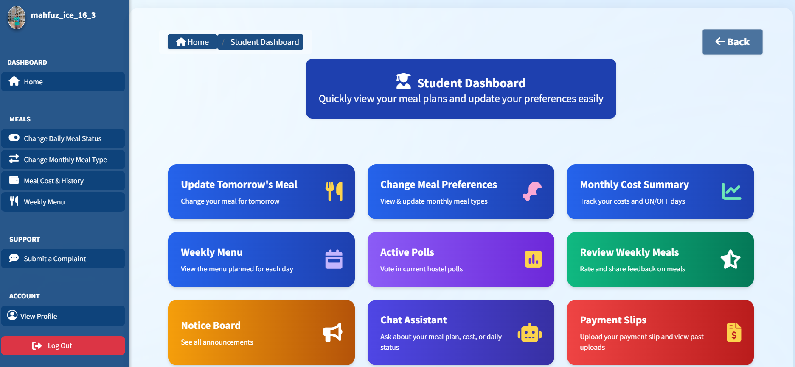
    <figcaption>👨‍🎓 Student Dashboard</figcaption>
  </figure>
  <figure>
    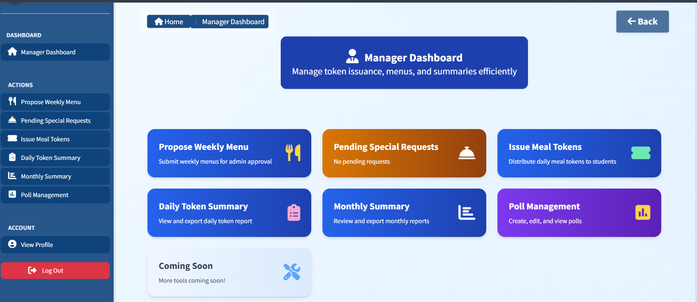
    <figcaption>👨‍🍳 Manager Dashboard</figcaption>
  </figure>
  <figure>
    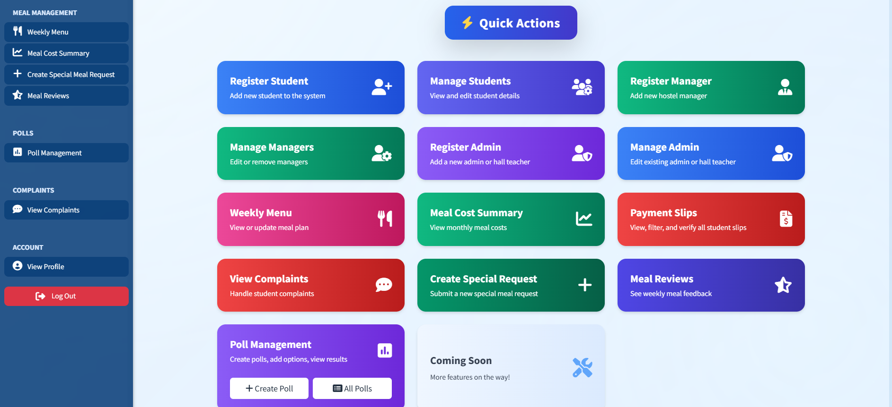
    <figcaption>🧑‍💼 Admin Dashboard</figcaption>
  </figure>

  <figure>
    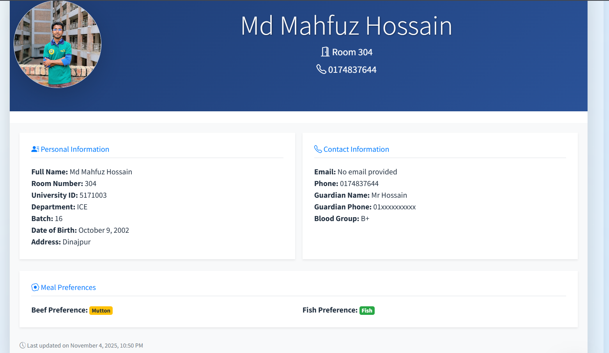
    <figcaption>👤 Student Profile</figcaption>
  </figure>
  <figure>
    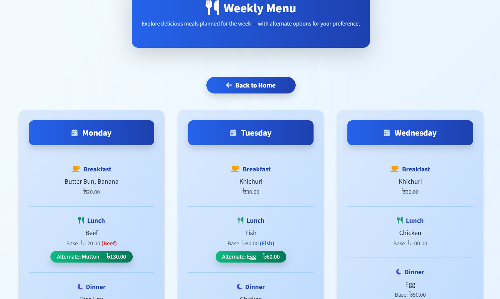
    <figcaption>📅 Weekly Menu</figcaption>
  </figure>
  <figure>
    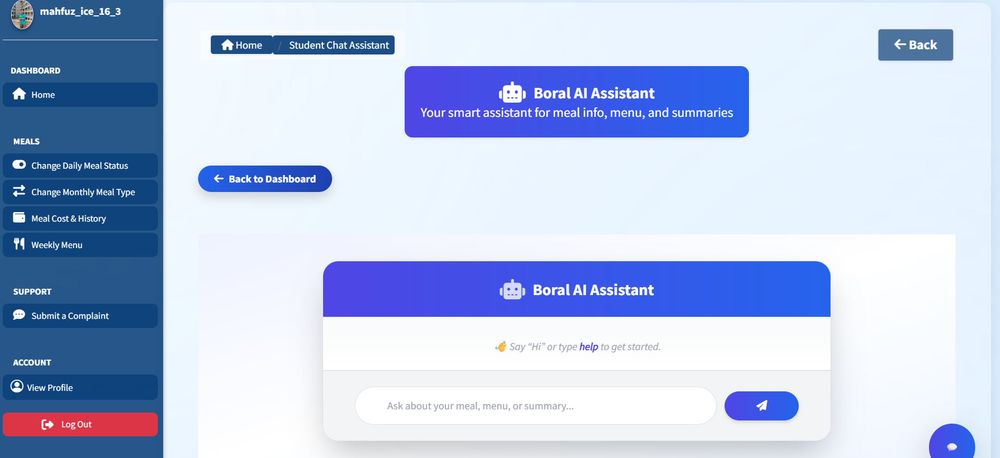
    <figcaption>🤖 Boral AI Assistant</figcaption>
  </figure>

  <figure>
    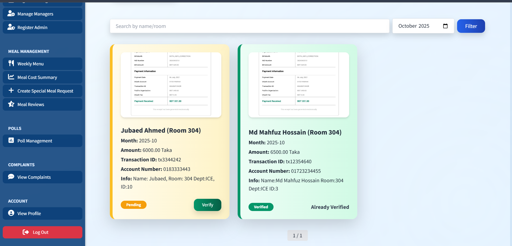
    <figcaption>💳 Payment Verification</figcaption>
  </figure>
  <figure>
    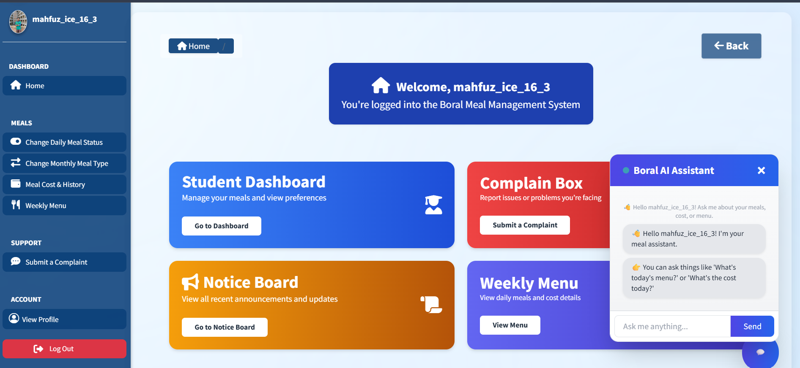
    <figcaption>🏠 Student Home</figcaption>
  </figure>
  <figure>
    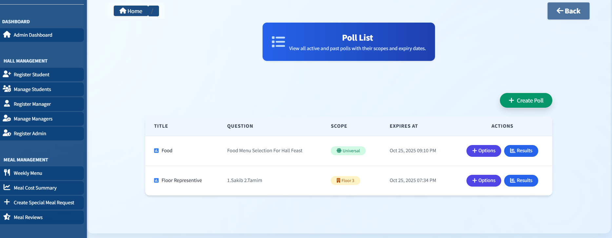
    <figcaption>🗳️ Two Types Poll System</figcaption>
  </figure>

  <figure>
    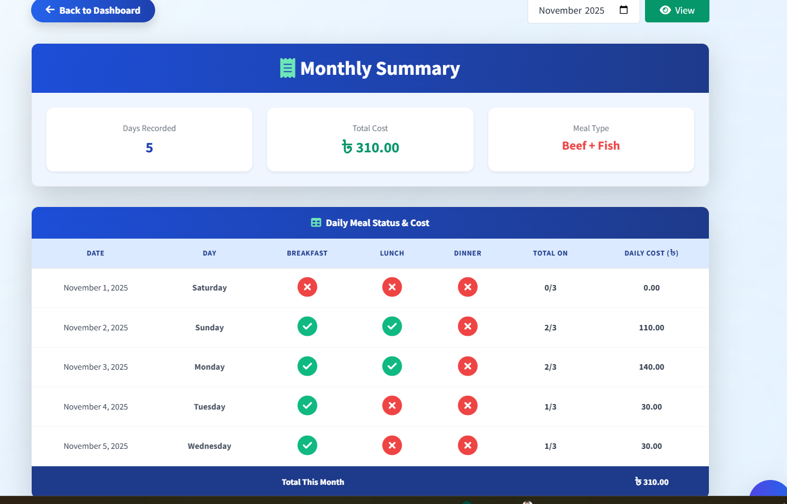
    <figcaption>🧾 Daily Cost Summary</figcaption>
  </figure>
  <figure>
    
    <figcaption>📊 Monthly Meal Type</figcaption>
  </figure>
  <figure>
    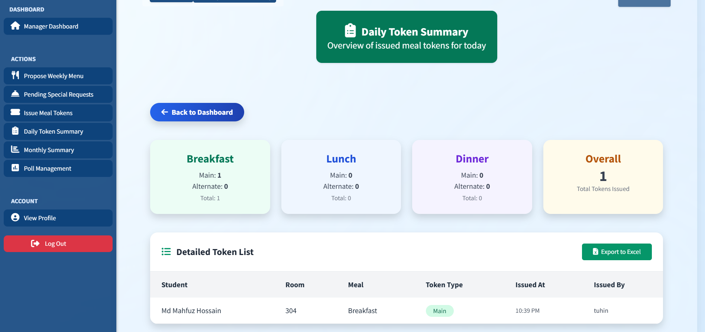
    <figcaption>🎟️ Daily Token Summary</figcaption>
  </figure>

  <figure>
    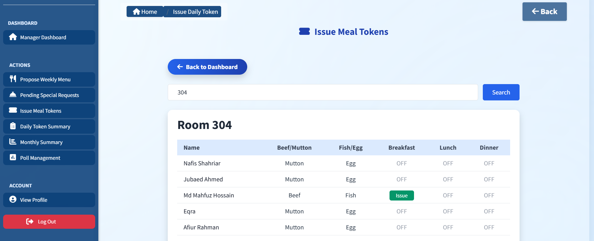
    <figcaption>👨‍🍳 Manager Token Issue</figcaption>
  </figure>
  <figure>
    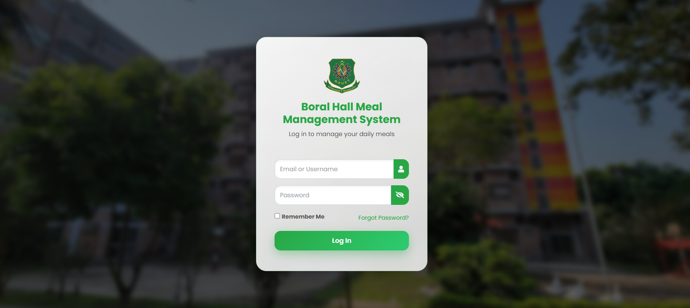
    <figcaption>🔑 Login Page</figcaption>
  </figure>
</div>


## 🧩 Future Roadmap
- 🧠 Full AI Agent support for decision automation
- 📱 Responsive UI for all devices (mobile-first)
- 🔔 Real-time meal & notice notifications
- 💳 Payment & billing integration
- 📊 Interactive analytics dashboard
- 🌐 Multi-hall support
- ☁️ Cloud deployment via Docker
- 📬 Automated meal reminders through email or chatbot

🪪 License
This project is licensed under the MIT License – see the LICENSE file for details.

## 🙋‍♂️ Author

Md Mahfuz Hossain  
Backend Developer | Django Enthusiast  
[GitHub](https://github.com/mdmahfuzbipu) | [LinkedIn](https://www.linkedin.com/in/muhammadmahfuzhossain/)